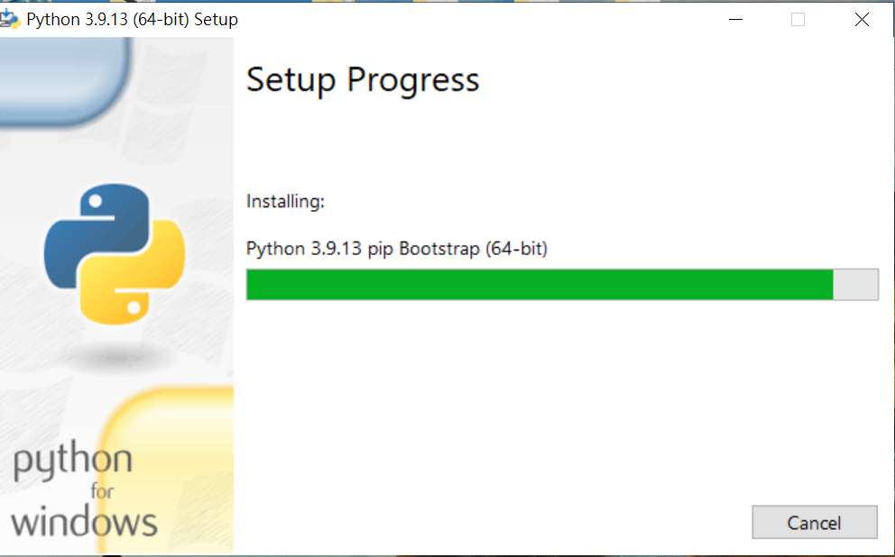

# 開發工具介紹

## Python環境安裝
>官方網址[https://www.python.org/downloads/]
>>版本考量(使用的開發工具是否支援)
>>用途

>環境變數設定
>>系統設定/環境變數

## 微軟Visual Studio 2015 python 3.5,2017 python
>官方網址[https://visualstudio.microsoft.com/zh-hant/vs/older-downloads/]
>import點取專案按右鍵/install python packge

## Spyder安裝
 >Spyder (新手)[spyder官方網址](https://www.spyder-ide.org/)

## Pycharm安裝
 Pycharm (推薦) 社區版[Pycharm官方網址](https://www.jetbrains.com/pycharm/)

## Jupyter Notebook安裝
 Jupyter Notebook[jupyter官方網址](https://jupyter.org/install)
